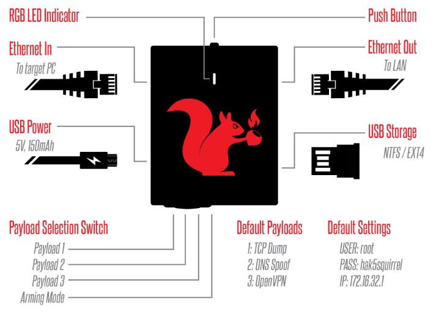

# fcn-for-packetsquirrel
===

a private custom payload for hak5 packetsquirrel



**用法**

先将PacketSquirrel切换到Arming模式，上电启动后将 `payload.sh`，`fcn`，`fcn.conf` 这三个文件下载并部署到 `/root/payloads/switch3/` 目录下，替换掉原有的OpenVPN payload，然后分别设置好文件权限：

`chmod 755 /root/payloads/switch3/{payload.sh,fcn}`

`chmod 644 /root/payloads/switch3/fcn.conf`

`Ethernet Out` 接口联网模式默认为 `DHCP客户端模式`，DNS服务器默认使用的是 `8.8.8.8`，上电后等到LED灯亮 `青色` 时(持续5秒)按下 `BUTTON按键`，就会配置为 `NAT模式`，如果没有按键操作的话，就会配置为 `桥接模式`

注意 `payload` 开关位置对应拨到3号位上

**修改为静态地址**

将 `payload.sh` 中的 `DHCP_MODE` 变量的值修改为 0

然后再修改如下字段中的IP地址为实际使用的静态IP地址

- 第 22 到 25 行 - NAT/VPN模式，修改 `Ethernet Out` 接口为静态IP地址

```
uci set network.wan.ipaddr='192.168.1.100'
uci set network.wan.netmask='255.255.255.0'
uci set network.wan.gateway='192.168.1.1'
uci set network.wan.dns='8.8.8.8 8.8.4.4'
```

- 第 33 到 36 行 - 桥接模式，修改桥接接口为静态IP地址

```
uci set network.lan.ipaddr='192.168.1.110'
uci set network.lan.netmask='255.255.255.0'
uci set network.lan.gateway='192.168.1.1'
uci set network.lan.dns='8.8.8.8 8.8.4.4'
```

**FCN服务端配置**

修改 `fcn.conf` 配置文件

```
[uid]=USER_ID
[name]=SERVER_NAME
[psk]=SERVER_PASS
[uic]=UNIQUE_CODE
[host]=vip.xfconnect.com
#[client]=0
#[udp]=1
#[tls]=1
#[log]=fcn.log
#[authfile]=users
#[nat_nic]=eth0
#[notun]=1
#[tport]=8000
#[uport]=5000
#[compress]=1
##############################
#[dhcp_ip]=10.10.0.1
#[dhcp_mask]=255.255.255.0
#[dhcp_dns]=223.5.5.5
#[route]=
#192.168.1.0/255.255.255.0
##############################
#[proxy]=socks5
#[proxy_host]=
#[proxy_port]=
#[proxy_usr]=
#[proxy_psk]=
##############################
```

前5行为必填项，相关配置参数需从FCN运营方购得付费账号后方可继续

***自定义FCN服务端路由推送***

```
#[route]=
#192.168.1.0/255.255.255.0
```

取消如上几行配置项的注释，此外可以配置多条路由推送规则，如

```
[route]=
192.168.1.0/255.255.255.0
172.16.0.0/255.240.0.0
10.0.0.0/255.255.255.0
```
